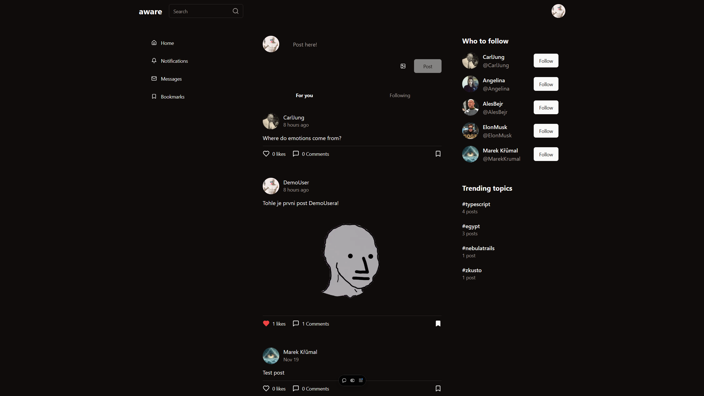

AWARES SOCIAL MEDIA APP NEXT.js /TS /Tailwind



### DEMO APP
-   [DEMO-APP DEPLOYMENT](https://awares33.vercel.app/)

### FUNKCE / INFO
-  Next.js 15, TS, React, JS
-  TanStack React Query
-  Infinite scrolling feeds
-  File uploads with drag & drop and copy-paste support (UploadThing)
-  Like system, Follow system, Comment system, Notification system, Bookmarks
-  DM system (powered by Stream)
-  Full-text search
-  Lucia authentication (username/password & Google OAuth2)
-  Postgres DB with Prisma
-  Hashtags & mentions
-  Advanced caching & revalidation
-  Dark theme, light theme, and system theme
-  Real-time form validation with React Hook Form & Zod


### Setup .env file

```shell
# vercel postgres
POSTGRES_URL=""
POSTGRES_PRISMA_URL=""
POSTGRES_URL_NO_SSL=""
POSTGRES_URL_NON_POOLING=""
POSTGRES_USER=""
POSTGRES_HOST=""
POSTGRES_PASSWORD=""
POSTGRES_DATABASE=""

#uploadthing
UPLOADTHING_SECRET=
NEXT_PUBLIC_UPLOADTHING_APP_ID=

# Stream
NEXT_PUBLIC_STREAM_KEY=""
STREAM_SECRET=""

#other
CRON_SECRET=""
NEXT_PUBLIC_BASE_URL=""

#Google auth
GOOGLE_CLIENT_ID=""
GOOGLE_CLIENT_SECRET=""

```


### Start the app

```shell
npm run dev
```
